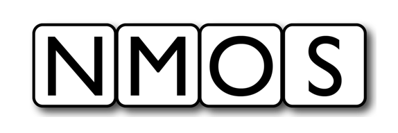

# AMWA NMOS Template Specification: Overview
{:.no_toc}

* A markdown unordered list which will be replaced with the ToC, excluding the "Contents header" from above
{:toc}

_(c) AMWA 2021, CC Attribution-NoDerivatives 4.0 International (CC BY-ND 4.0)_

> ## Instructions
>
> **Delete this section after creating a new repo from this template.**
>
>Use this template repo to create a new AMWA NMOS Specification repo.
>
> Add your content as (GitHub Flavoured) Markdown documents.
>
> - For consistency with other specifications, keep this `Overview.md` but remove these Instructions.
>
> Put diagrams (ideally PNG with encapsulated draw.io source) in the `images/` sub-directory.
>
> Follow the [Style Guide](Style%20Guide.md).
>
> Make a bulleted list of documents in `README.md` in this directory.
> 
> Set the repo name used to get the Lint and Render status in the top-level `README.md` (four changes needed).
>
> Set the value of `amwa_id` in `.render/_config.yml` to the AMWA-assigned ID.

## Introduction

> Provide an overview of the Specification.

Familiarity with the [JT-NM Reference Architecture](https://jt-nm.org/reference-architecture/) is assumed.

See also the [NMOS Technical Overview](https://specs.amwa.tv/nmos/main/docs/Technical_Overview.html).

## Use of Normative Language

The key words "MUST", "MUST NOT", "REQUIRED", "SHALL", "SHALL NOT", "SHOULD", "SHOULD NOT", "RECOMMENDED", "MAY",
and "OPTIONAL" in this document are to be interpreted as described in [RFC 2119][RFC-2119].

## Definitions

The NMOS terms 'Node', ... are used as defined in the [NMOS Glossary](https://specs.amwa.tv/nmos/main/docs/Glossary.html).

> List as appropriate

This specification also defines the following terms.

### Example Term

Example definition

[RFC-2119]: https://tools.ietf.org/html/rfc2119 "Key words for use in RFCs"
